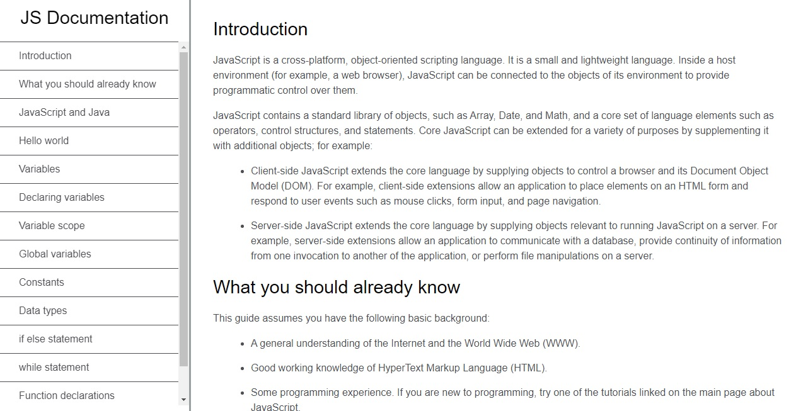

# documentation-page

"Build A Technical Documentation Page" about Javascript - freeCodeCamp - Responsive Web Design Certification Project

You can use HTML and CSS to complete this project.

REQUIREMENTS

1. User Story #1: I can see a main element with a corresponding id="main-doc", which contains the page's main content (technical documentation).

2. User Story #2: Within the #main-doc element, I can see several section elements, each with a class of main-section. There should be a minimum of 5.

3. User Story #3: The first element within each .main-section should be a header element which contains text that describes the topic of that section.

4. User Story #4: Each section element with the class of main-section should also have an id that corresponds with the text of each header contained within it. Any spaces should be replaced with underscores (e.g. The section that contains the header "Javascript and Java" should have a corresponding id="Javascript_and_Java").

5. User Story #5: The .main-section elements should contain at least 10 p elements total (not each).

6. User Story #6: The .main-section elements should contain at least 5 code elements total (not each).

7. User Story #7: The .main-section elements should contain at least 5 li items total (not each).

8. User Story #8: I can see a nav element with a corresponding id="navbar".

9. User Story #9: The navbar element should contain one header element which contains text that describes the topic of the technical documentation.

10. User Story #10: Additionally, the navbar should contain link (a) elements with the class of nav-link. There should be one for every element with the class main-section.

11. User Story #11: The header element in the navbar must come before any link (a) elements in the navbar.

12. User Story #12: Each element with the class of nav-link should contain text that corresponds to the header text within each section (e.g. if you have a "Hello world" section/header, your navbar should have an element which contains the text "Hello world").

13. User Story #13: When I click on a navbar element, the page should navigate to the corresponding section of the main-doc element (e.g. If I click on a nav-link element that contains the text "Hello world", the page navigates to a section element that has that id and contains the corresponding header.

14. User Story #14: On regular sized devices (laptops, desktops), the element with id="navbar" should be shown on the left side of the screen and should always be visible to the user.

15. User Story #15: My Technical Documentation page should use at least one media query.

16. Personal User Story: After I complete the 15 user stories, I will edit the technical content as well.

You can find Responsive Web Design Certification <a href='https://www.freecodecamp.org/learn/responsive-web-design/'>here</a>.
